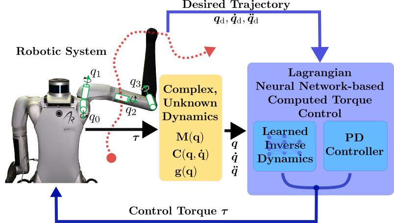

My research explores inductive biases in machine learning as applied to robotics and control problems.
Within this domain, I concentrate on:

What roles do inductive biases play in improving the performance and generalization of robot learning algorithms? How can inductive biases be systematically integrated into generic deep learning frameworks to enhance their applicability to robotic tasks?

A full list of all publications can be found at [Google Scholar](https://scholar.google.com/citations?user=rVmmxF8AAAAJ&hl=de)

________

Using Lagrangian Neural Networks for Computed Torque Control
======

    
    
<em>Figure: Schematic of the proposed LNN-CTC framework</em>

---
This research presents a physics-informed control framework that integrates Lagrangian Neural Networks (LNNs) into a Computed Torque Control (CTC) architecture for accurate and adaptive robotic trajectory tracking. Instead of relying on precise analytic models, the LNN learns the robot’s inverse dynamics directly from data while enforcing physical consistency through Lagrangian mechanics.

By embedding the learned model inside the feedback-linearization loop (LNN-CTC), the controller shapes the closed-loop error dynamics rather than adding a simple feedforward correction. This results in improved tracking accuracy, robustness to disturbances, and strong generalization with minimal training data, outperforming classical model-based and black-box neural controllers.

An online learning extension continuously updates the LNN during operation, enabling rapid adaptation to dynamic changes such as added payloads. The approach achieves fast gravity compensation, data-efficient learning, and real-time performance without prior model knowledge, making it well suited for robots operating under uncertain and changing conditions. [[RAL26](https://ieeexplore.ieee.org/abstract/document/11352810)][[CoDIT25](https://ieeexplore.ieee.org/abstract/document/11321475)]

________

Real-Time Learning Control for Quadruped Robot Velocity Tracking 
======

    
    
<em>Animation: Go1 Robot walking</em>

________

This research presents a control framework for quadruped robots that achieves accurate velocity tracking by combining Proportional-Derivative (PD) control, Iterative Learning Control (ILC), and Gaussian Process Regression (GPR). The PD controller provides real-time feedback using inverse kinematics, while ILC learns feedforward torques from repetitive gait cycles to compensate for unmodeled dynamics. GPR then generalizes these learned torques across different velocities, eliminating the need for relearning at each speed. [[ECC24](https://ieeexplore.ieee.org/abstract/document/10590932)] [[ICARCV24](https://ieeexplore.ieee.org/abstract/document/10821620)]

